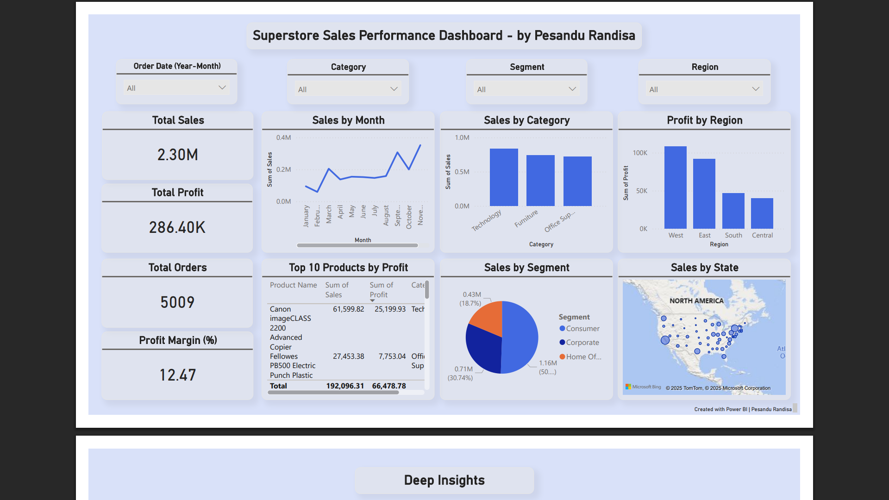

# Superstore Sales Analytics (Power BI, Python, SQL)
### By Pesandu Randisa | Data Analyst Portfolio Project

This project showcases a complete end-to-end data analytics workflow using a real retail dataset.  
It demonstrates the skills expected from a Data Analyst / BI Analyst in a real business environment:

- Data Cleaning (Python)
- SQL for Insights
- Exploratory Data Analysis (Python)
- Power BI Dashboard Development
- Business Recommendations

---

## Project Objectives

- Analyze sales, profit, and customer behavior patterns
- Identify top-performing categories, segments, and regions
- Understand how discounts affect profitability
- Build an interactive Power BI dashboard for decision-makers
- Provide actionable business recommendations

---

## Tech Stack

- Storage -> SQLite 
- Data Prep -> Python (Pandas, Matplotlib, Seaborn)
- Querying -> SQL
- Visualization -> Power BI
- Documentation -> Markdown

---

## Key Business Findings

- **Total Sales:** $2.30M  
- **Total Profit:** $286.40K  
- **Profit Margin:** 12.47%  
- **Top Category:** Technology  
- **Top Region:** West
- **Top Customer Segment:** Consumer  
- **High discounts (>20%) reduce profit significantly**  
- **Q4 shows strong seasonal peaks**

---

## Dashboard Preview

---

## Project Structure

- data/ → raw & cleaned data
- sql/ → all SQL queries
- notebooks/ → exploratory data analysis
- dashboard/ → Power BI .pbix + PDF export
- reports/ → insights report + recommendations
- scripts/ → load_to_sqlite.py
- README.md → project documentation

---

## End-to-End Workflow

### 1 Data Engineering
- Loaded CSV → SQLite using Python
- Cleaned dataset and standardized date formatting
- Exported final clean version for Power BI

### 2️ SQL Insights
- Category profitability  
- Discount impact  
- Top customers  
- Monthly revenue trends  

### 3️ Python EDA
- Bar charts, line charts, heatmaps  
- Profit vs Discount exploration  
- Trend analysis (Q4 peak)

### 4️ Power BI Dashboard
- KPIs for Sales, Profit, Orders, Margin
- Filters: Region, Category, Segment, Order Date
- Trends: Monthly Sales, Regional Profit
- Deep Insights: Discount vs Profit, Shipping Mode, Treemap

---

## Business Recommendations

1. Reduce heavy discounting above 20%
2. Increase marketing investment in Technology category
3. Improve shipping performance in Central region
4. Build loyalty program for top customers

---

## How to Use This Repo

- Clone and open the Power BI file: dashboard/superstore_dashboard.pbix
- Run notebook: notebooks/eda_analysis.ipynb

---

## Outcome

This project demonstrates:
- Strong analytical thinking  
- End-to-end BI project execution  
- SQL + Python + Power BI mastery  
- Business storytelling ability  

Perfect for Data Analyst / BI Analyst roles.

---

